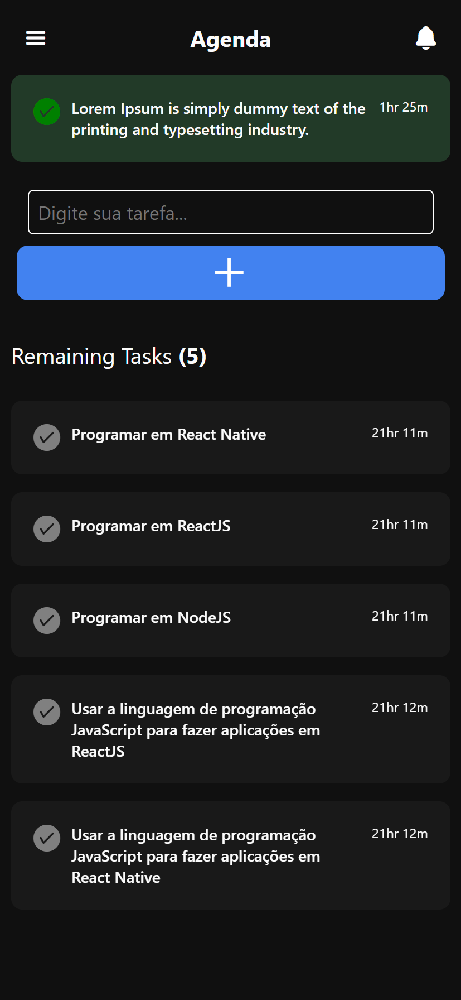

# to-do-list-react-native
To-do list done in React Native

## Challenges Encountered
I took a base from an internet interface and started doing the front-end, I made a simple system using useState with an array, and I pushed every time I add a new task, after that, I made a list using FlatList, using the data of the array. I made the front-end with the help of a Developer called Eriton.

## Screenshots

## Special thanks
- [Eriton](https://github.com/both-eritons)
